# Cross-talker generalization: figures and analysis update

I have revised the figures following your PDF annotations and the messages about Figure 1 and the AN19 phoneme analysis. The main changes are:

1. **One behavioral ceiling.** You are right that the ceiling does not depend on SBI versus HVE. My earlier wording was misleading: the old ceiling tables are identical. What I need to match is the response sample, folds, statistic and fitting procedure.
2. **Shared figure style.** I have adopted the language groups and colors in your world-map code. I have added both distance and similarity matrices with English talkers, marginal distributions below the control curves, and the black pooled X21 curves.
3. **Layerwise likelihood.** I recovered the three-fold predictor-only scores for all 18 registered HuBERT layers and both acoustic baselines. The new likelihood plots complement the z plots. They come from retained runs, not a new parameter search.
4. **The X21 HVE comparison.** Condition does add to HVE: p = .0117. HVE itself has a strong negative association before condition is added. The p = .053 result concerns HVE's additional contribution after controlling for condition, not its predictor-only association.
5. **AN19 phoneme annotations.** I have processed all 6,261 recordings with automatic phone alignment and independent IPA recognition. I used the original `July/Nygaard_audio` directory and recorded the filename mappings. The outputs distinguish intended-phone timing from recognized pronunciation; they do not supply listener error labels.

I explain these points below. The updated figures and source tables accompany this report; Figure 2d and the other listed analyses remain separate work.

---

## Figure 1a-b: simplifying the representation example

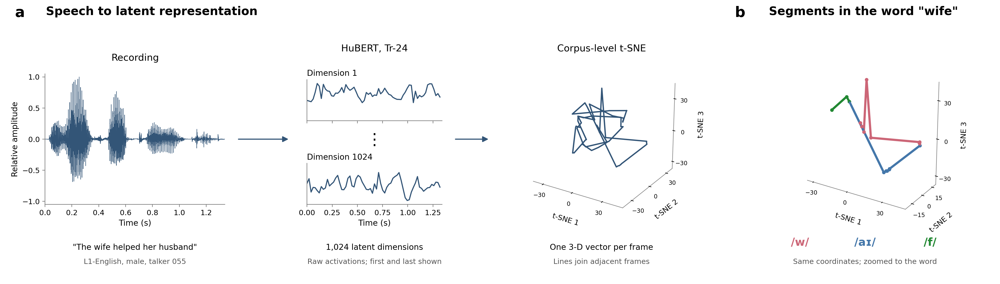

I have grouped the waveform, latent dimensions and t-SNE trajectory into panel a, with the word/segment illustration in panel b. I show Dimension 1 and Dimension 1024 with a vertical ellipsis between their axes, use a white background, and keep the word and phone labels separate from the trajectories.

I changed the example to "The wife helped her husband", from the same English-L1 male talker 055. All five English manifests label the earlier sentence "A boy fell from a window", so I have not changed its article without verifying the recording. The new example uses the existing Tr-24 features and annotated word "wife" (W, AY1, F); it also avoids the previous one-frame vowel. No features or t-SNE coordinates were recomputed.

---

## Figure 1c: language backgrounds

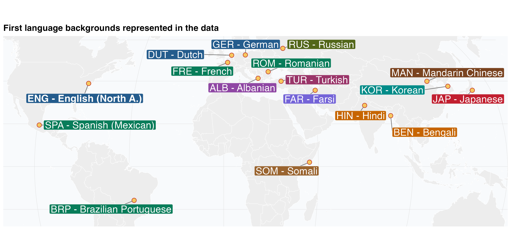

I have retained your map and used the exact language-group colors from its R script in the language coverage, inventory and control-intelligibility figures. I have preserved which languages share a color.

The locations are the associated national capitals used in your script, not the individual talkers' recording locations. I have kept the companion coverage figure in the supplementary information.

---

## Supplementary figure: talker coverage by dataset

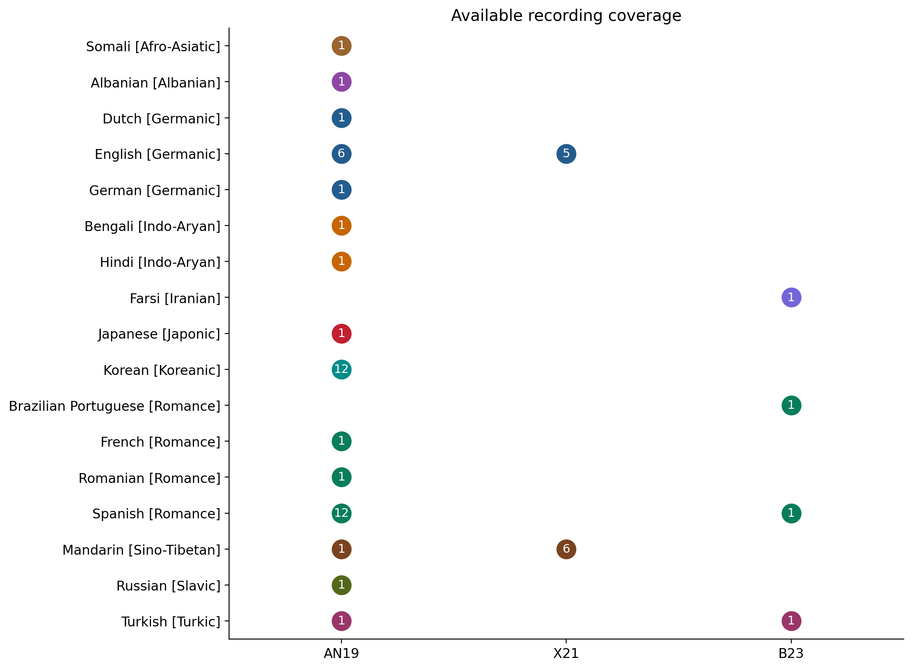

I have kept this figure for the supplementary information, as you suggested. Counts refer to the available speech corpora, including the English reference recordings, rather than listeners or exposure conditions. There are 17 L1 labels across the datasets.

I use Hindi and Mandarin for the original AN19 labels "Indian" and "Chinese", following the study's Table I. The color groups now follow your world map, including its Afro-Asiatic and Sino-Tibetan group labels.

---

## Figure 1d: inventory similarity to English

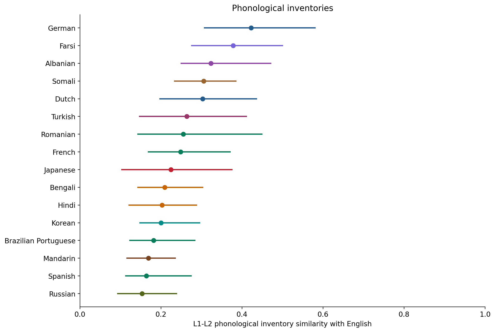

I removed inventory counts, updated the axis wording and matched the map colors. Points show mean consonant/vowel inventory Jaccard overlap with English; lines show source ranges, not confidence intervals.

I would place this summary above your feature examples. Before adding tone, I need to distinguish absent tone from missing annotation and specify its weighting. Source: Moran & McCloy (eds.), [PHOIBLE 2.0](https://phoible.org/), v2.0, CC BY-SA 3.0.

---

## Figure 1d companion: specific phonological features

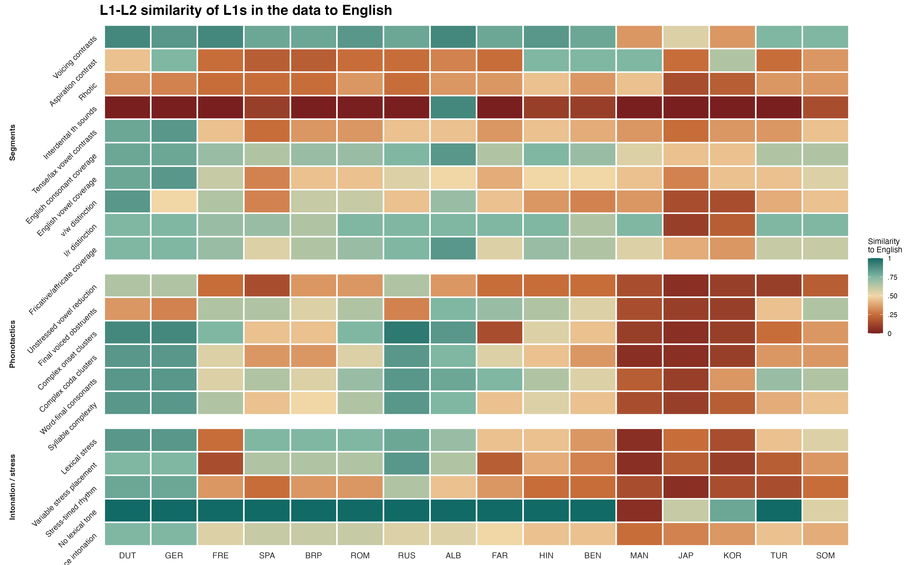

I have included your feature comparison alongside the inventory summary. It covers segmental, phonotactic and prosodic properties that the consonant/vowel inventory calculation does not capture.

I have not recomputed these cell values or treated them as PHOIBLE-derived measurements. I have the supplied image/PDF and the map code, but still need the heatmap's score table and generation code to document its scale and reproduce it. The last row label is clipped in the supplied graphic; I would fix that in its source before combining the panels for the paper.

---

## Figure 2a: mean pronunciation distance

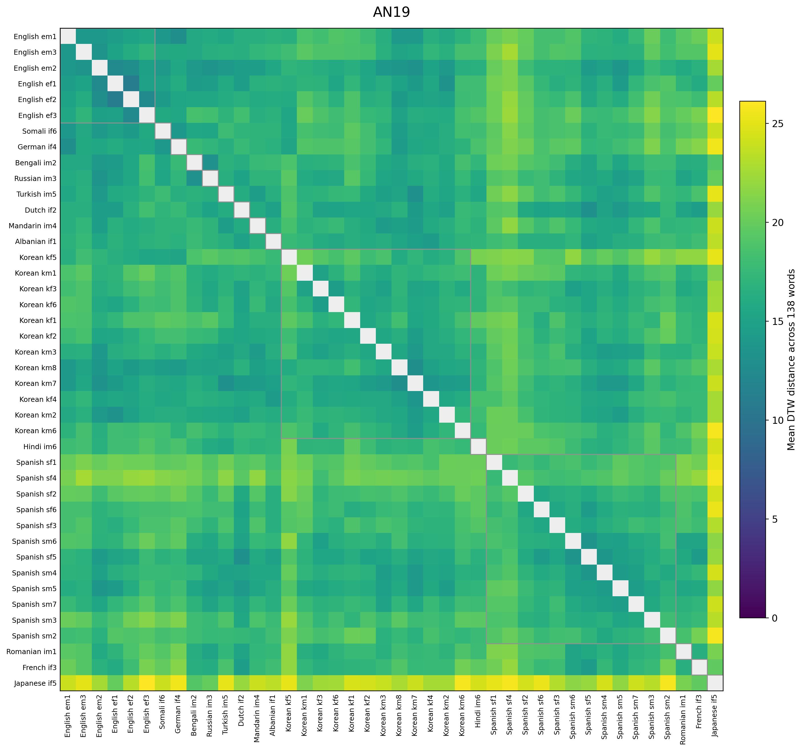

I have added the six English reference talkers, bringing the matrix to 42 talkers. Each cell averages same-word DTW distance across the same 138 words. Labels begin with the language and are black; gray outlines identify within-language blocks.

English appears first. I ordered the other language groups by mean distance to English and clustered talkers within each language using their pairwise distances. This ordering is descriptive and uses no intelligibility outcomes. The color scale is linear, so darker/lighter differences are not expanded by a log transformation.

---

## Figure 2a companion: mean pronunciation similarity

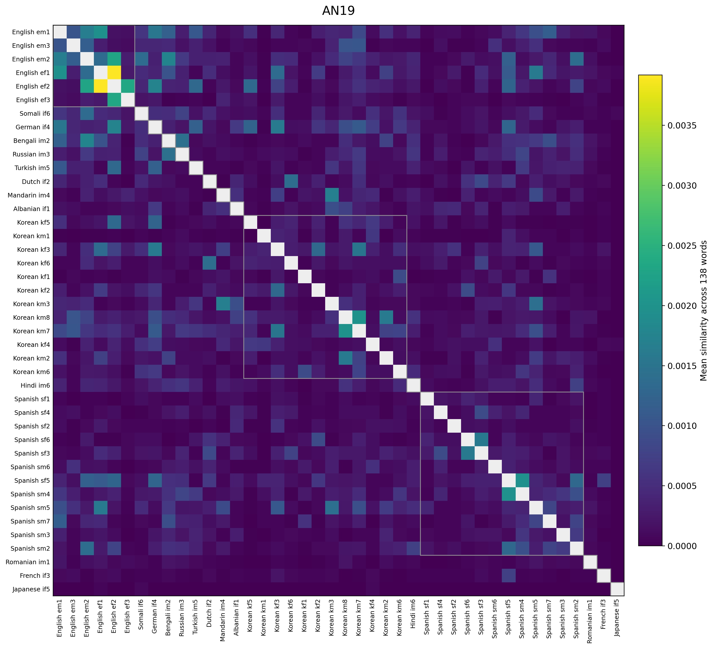

This is the similarity version with the same talker order and a linear color scale. I retained k = 1: each cell is the mean of exp(-DTW distance) across 138 words. It is not exp(-mean distance).

The two panels therefore show different summaries, not just different labels for the same colors. I removed the logarithmic display and shortened the colorbar label as requested. Self-comparisons remain masked in both panels.

---

## AN19 phoneme annotations: full-corpus processing

I have run two recent phonetic models on all 6,261 recordings from `July/Nygaard_audio`, without a small-scale pilot. All audio hashes match the corresponding feature-source recordings. Two Somalian filenames have different item numbers; I mapped those by identical audio hashes and left the files unchanged. I have not rerun HuBERT or t-SNE.

| Method | Completed output | Interpretation |
|---|---|---|
| FALCON target-conditioned alignment | 6,261 recordings; 18,785 non-silence intervals | Estimated timing for the intended canonical phones |
| PhoneticXEUS waveform-only recognition | 5,872 nonempty IPA hypotheses; 389 empty outputs | Independently recognized pronunciation, without providing the target word |

The models answer different questions. An aligner given the expected word will try to place that word's phones, even when the speaker's actual pronunciation differs. I therefore keep the independent recognizer output separate. Neither output is a human phonetic annotation, and an ASR error is not a listener error.

The following three pages show an automatic Figure 2b candidate. I compare intended-phone intervals within the same word and canonical position against all six English reference speakers. I retain the original mean-sequence-length DTW normalization, tau = 2, and existing Tr-24 3-D t-SNE coordinates. The [annotation record](an19_phone_alignment/README.md) contains the source mapping, model revisions, scripts and full results. Model descriptions: [FALCON](https://arxiv.org/abs/2606.25460), [PhoneticXEUS](https://arxiv.org/abs/2603.29042).

For your subsequent request to average across all segments, I provide a separate [similarity plot](../../../output/pdf/AN19_all_segments_similarity.pdf) ([PNG](../../../output/figures/an19_phonemes/AN19_all_segments_similarity.png)). I calculate `exp(-DTW)` for each matched pair, average reference recordings within each English talker and then across the six English talkers, and average all eligible segment instances equally within each L2 talker. This replaces the previous all-segment summary's word/type weighting, not the underlying distances. Dots show the 36 individual talkers; open diamonds show equal-talker L1 means, ordered from higher to lower similarity. Horizontal bars show 95% percentile CIs for the L1 means, based on 1,000 bootstrap samples of talkers within each L1. I restored these following your feedback; single-talker groups have no estimated CI. I removed the figure's legend and explanatory text and shortened the x-axis label, keeping the methodological details here. The existing coverage rule retains 5,114 instances (136-150 per talker), so this is an average over eligible automatically aligned intended-phone instances, not every raw interval. The earlier phone-specific distance panels below are unchanged.

---

## Figure 2b candidate: vowel deviations

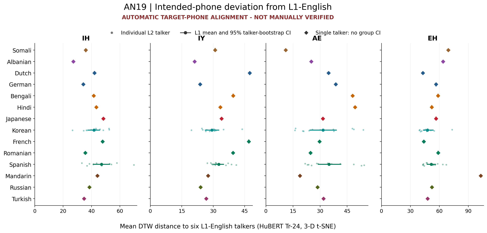

I average distances within each English speaker before averaging the six references. I then average within word type and within each L2 talker. Small points show individual talkers; larger points show the L1 mean and 95% talker-bootstrap interval. Single-talker L1 groups have diamonds and no group CI. Colors follow your map. Panel labels use ARPAbet; horizontal scales differ across panels.

---

## Figure 2b candidate: further intended-phone contrasts

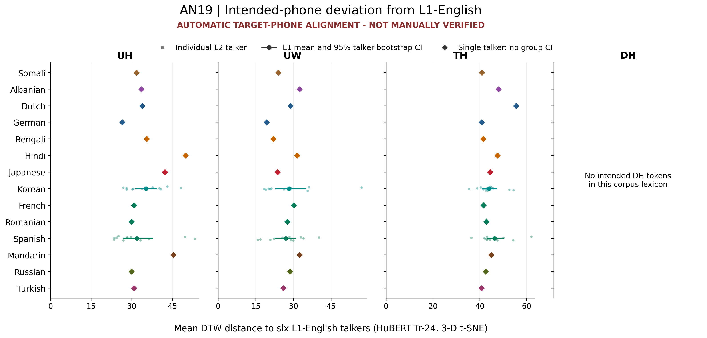

I fixed the twelve displayed phone types before calculating these deviations. DH has no intended tokens in this corpus's target lexicon, so I show that absence explicitly rather than inventing a value or substituting another phone. The twelve-panel overview and estimates for all supported phone types are supplied separately.

Word coverage varies by talker and phone. Some means use only one or two word types; these are not balanced-word tests of language-group differences.

---

## Figure 2b candidate: interpretation and coverage

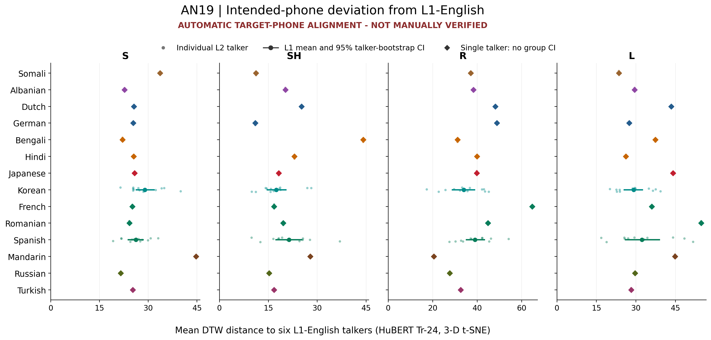

The complete calculation contains 67,084 matched phone-pair distances, but only 5,114 of 16,086 L2 intervals have usable frames and all six references. Across the corpus, 3,167 intended-phone intervals contain no HuBERT frame center; I leave them missing rather than interpolate a trajectory. HW74 wave/wade remains excluded.

The plots are descriptive automatic estimates. Requiring every target and reference interval to be at least 20 ms with mean target posterior at least .2 leaves only 197 intervals. That posterior is not calibrated accuracy, but the loss of coverage means I cannot yet claim these patterns are robust to annotation quality.

---

## Figure 2c: similarity to English and control-test accuracy

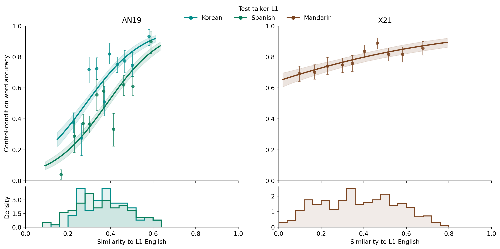

This shows **control-test performance**, not exposure performance. I added marginal distributions, a shared legend and dataset-only titles using your map colors. Each marginal distribution counts a matched test-word recording once, irrespective of listener count.

This conceptually extends [Kim et al. (2025)](https://doi.org/10.3758/s13423-025-02652-2), whose L2-to-English distances predicted relative talker intelligibility. Our matched-word, control-test analysis differs in design and unit of analysis.

Curves retain 95% intervals from 1,000 participant bootstraps: AN19 has 1,880 responses; X21 has 4,117. The 40 AN19 wave/wade responses remain excluded pending audio verification. The first-ten-exposure analysis remains separate, with the window defined before examining results.

---

## SBI: z across feature spaces

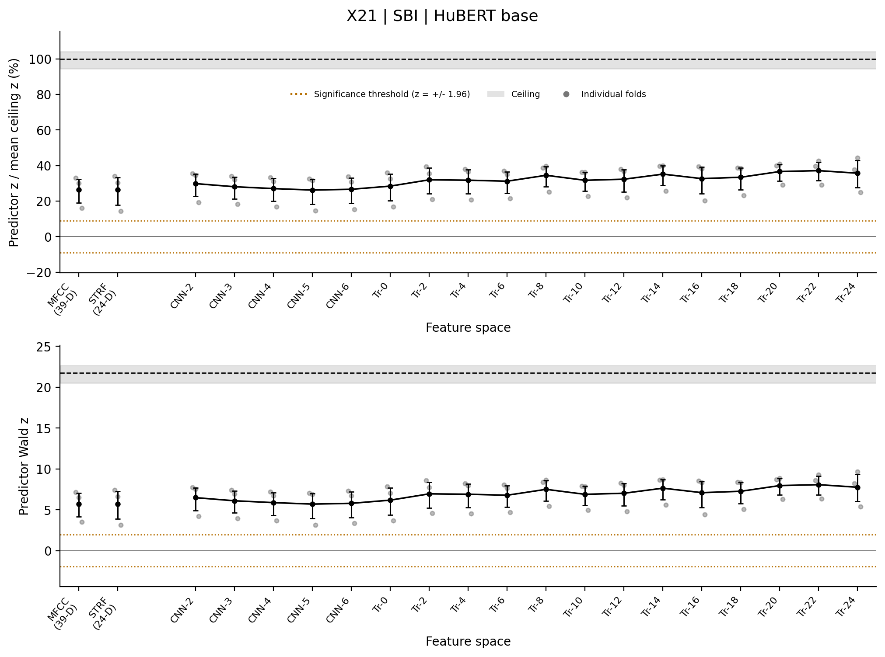

I reduced the figure width, shortened the x-axis label to "Feature space", and moved a three-entry legend below the ceiling. Points show individual folds and their mean with a 95% fold-bootstrap interval. The upper panel divides z by the mean behavioral ceiling; the lower panel retains raw z. The gray band shows ceiling uncertainty.

These remain the earlier notebook test-fold-refit statistics. The orange references are nominal z = +/-1.96; I have retained those per your annotation. They are not multiplicity-adjusted tests of the mean curve, and normalized z is not percentage variance explained. The same revised layout is available for all three datasets and both model variants.

---

## SBI: the likelihood companion

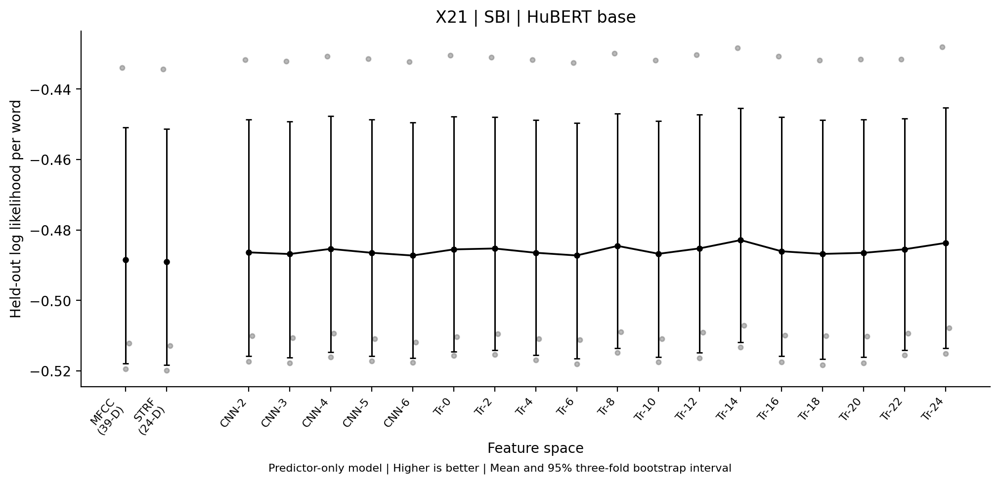

These are recovered predictor-only held-out scores for every registered layer and both acoustic baselines, using matching response rows. Higher is better. Log likelihood per word accounts for fold size; points, means and 95% bootstrap intervals use the three folds.

These runs used training-standardized negative DTW, whereas the notebook z plots used exponential similarity. This is therefore not a matched comparison of optimization objectives; that requires the same predictor construction and sample.

The ceiling line awaits the item-by-condition reference: current AN19/X21 keys omit condition. AN19 also varies its talker random-intercept structure after fitting fallbacks; a matched-structure rerun is needed for a controlled layer comparison.

---

## HVE: likelihood across layers and definitions

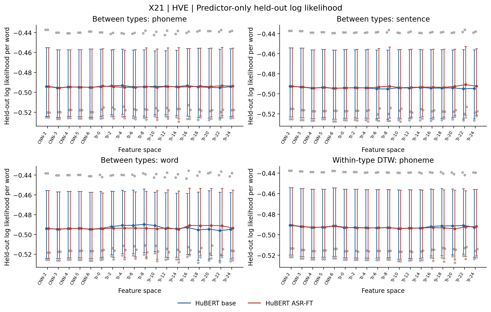

I also added likelihood profiles for every available revised HVE definition, across all 18 registered layers and both HuBERT variants. This page shows four X21 definitions; the accompanying figures contain the remaining definitions and datasets. All curves show predictor-only held-out scores with 95% three-fold bootstrap intervals.

For B23, I keep the 97-participant global-order sample separate from the 168-participant order-independent sample. I do not rank those samples against each other by total log likelihood. The revised HVE z profiles remain available separately; the old notebook ceiling should not normalize their training-fold z values.

---

## X21: condition-specific similarity curves

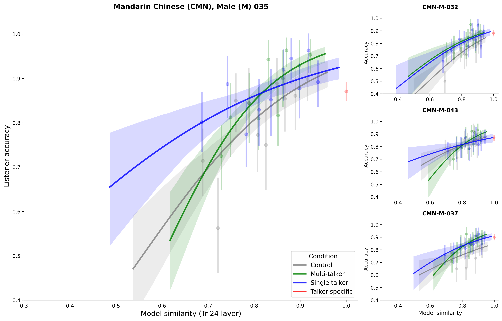

I moved the language ahead of the talker identifier and corrected CMN in the titles. The main panel is talker 035; the smaller panels are 032, 043 and 037. These plots use exposure-test similarity rather than the English-reference similarity in Figure 2c.

I retained the original descriptive curves, points and intervals. Their existing metadata do not identify the bootstrap resampling unit, so I have not relabeled these intervals as participant-bootstrap or three-fold intervals. The model comparisons, rather than the curve offsets alone, test the additional contribution of condition.

---

## X21: pooled across conditions

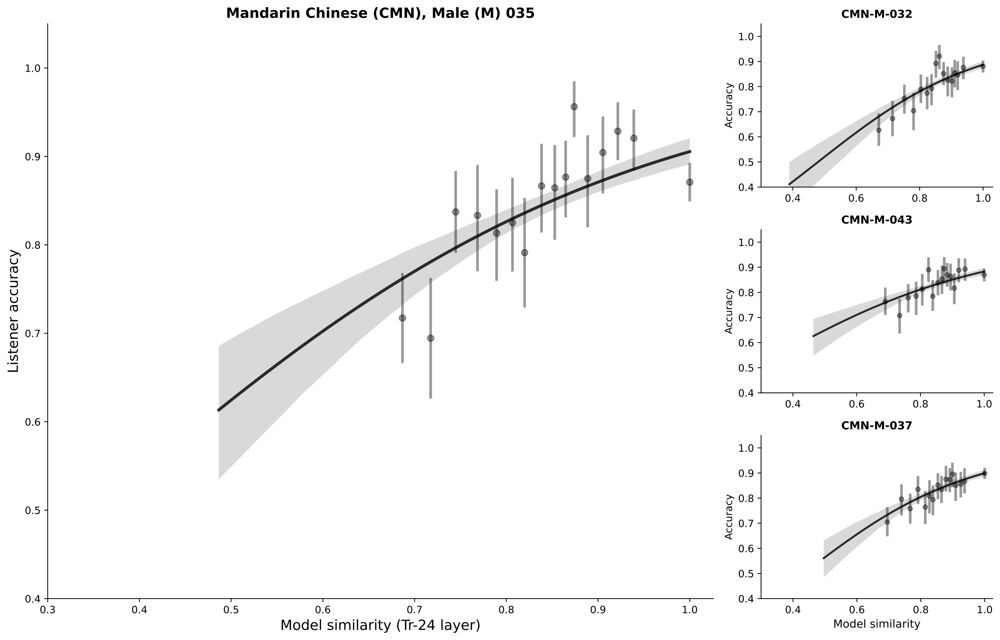

This is the requested single black curve and point series for each talker. I pooled the trial rows across conditions, using 20 bins instead of the 10 bins in the condition-specific figure. It is not an equal-weight average of four separately fitted condition curves.

Both versions use the same 16,477 trial responses from 320 participants. I have retained the existing fits and uncertainty intervals rather than refitting the human-response model for this display update.

---

## Clarifying the X21 HVE and condition comparisons

I checked the original tables: SBI and HVE use the same 16,477 responses, 320 participants, 412 items and four test talkers in X21. Their condition-only models have identical log likelihood, -5484.3114.

| Quantity | HVE: CNN-6 within-word transitions | SBI: base Tr-14 |
|---|---|---|
| Predictor-only z | -5.5038 (p = 3.72e-8) | 4.7807 |
| Predictor z after adding condition | -1.9516 | 2.6336 |
| Predictor beyond condition | Chi-square(1) = 3.7383; p = .05318 | Chi-square(1) = 6.5176; p = .01068 |
| Condition beyond predictor | Chi-square(3) = 11.0085; p = .01168 | Chi-square(3) = 21.0030; p = .000105 |

The borderline HVE result refers to its additional contribution **after condition is included**. HVE has a strong negative association in the predictor-only model, and condition still adds significantly to it. The negative direction is not support for the expected positive variability effect.

Condition adds less likelihood to HVE than to SBI here because the two reduced models already capture different parts of the responses. These incremental tests need not be equal. The selected HVE base/FT inputs and results are identical, so I do not count them as two independent replications. These combined-fold tests remain exploratory because layer/method selection used the same study.

---

## A shared ceiling and comparable analysis samples

My earlier phrase "an HVE-compatible ceiling" was confusing. The historical SBI and HVE ceiling files already contain exactly the same nine fold values. I should use one behavioral reference for the two theories when the response rows, folds, statistic and fitting procedure are the same.

I do still need to resolve two practical differences. The historical ceiling is a test-fold-refit z, whereas revised HVE coefficients come from training-fold fits. Also, the direct AN19/X21 prediction ceiling currently groups by item and talker without condition; I need the item-by-condition grouping we discussed.

| Dataset | SBI sample | HVE sample |
|---|---|---|
| AN19 | 120 participants; 5,685 word responses | 120 participants; 5,760 word responses |
| X21 | 320 participants; 16,477 word responses | The same responses and model structure |
| B23 | 168 participants; 10,080 count rows | Same size for order-independent HVE; 97 participants and 5,820 rows for global order |

In AN19, the 75 extra HVE responses involve hung, mote, main and route. The selected SBI fit also dropped the talker random intercept after fitting problems, while HVE retained it. I need to align both the rows and random-effects structure before directly comparing the two theories there. Each existing within-family nested comparison uses its own matched rows and structure.

---

## What the acoustic scaling mismatch means

The full MFCC/STRF analysis standardizes each acoustic coordinate before calculating DTW: x becomes (x - corpus mean) / corpus standard deviation. The component analysis used the original coordinate values. I verified that this difference occurs across the same 5,459 recording pairs.

This changes how heavily each acoustic dimension contributes to distance and can change the DTW alignment. It is not the later standardization of the single GLMM predictor, and standardizing that predictor cannot undo it.

To identify which acoustic components account for AN19's strong result, I need to rerun the component subsets using the corresponding coordinates of the full baseline's standardizer, the same recordings, DTW settings, folds and response rows. Until then, I cannot interpret the component ranking as the effect of removing those dimensions. This mismatch alone does not show that the full-baseline result is wrong.

---

## Next analyses and materials

1. **Match the inferential comparisons.** Align response samples and random-effects structures; use a shared, item-by-condition behavioral reference for a defined statistic and evaluation procedure.
2. **Rerun the acoustic components.** Apply the same coordinate scaling and compare both z and likelihood on matched data.
3. **Complete the listener-error analysis.** Full-corpus AN19 acoustic annotation is now available without a pilot prerequisite. Figure 2d still needs target/response pronunciation alignment, a lexical-neighbor definition and the behavioral model. I will not treat ASR recognition errors as listeners' perception errors or machine boundaries as manually verified labels.
4. **Add early-exposure curves.** Define the first ten presentations and their associated word responses before examining the result, keep them separate from control-test performance, and check which datasets have usable trial order and responses.
5. **Finish Figure 1 sources.** Check tone coverage and weighting, obtain the feature-heatmap score table/code, and assemble the inventory summary above the examples. I have kept your original map and code alongside the revised figures.

The figures are saved locally in PNG, SVG and PDF where generated from code. I have not committed them to Git or uploaded them to Overleaf. The detailed comment-by-comment record and outstanding items are in REVIEW_RESPONSE.md and TODO.
