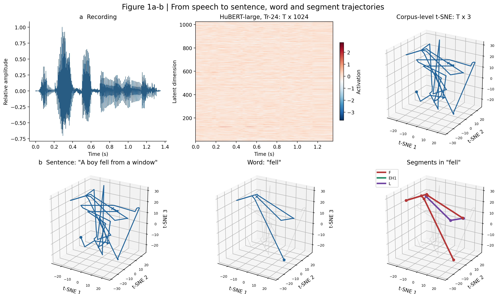
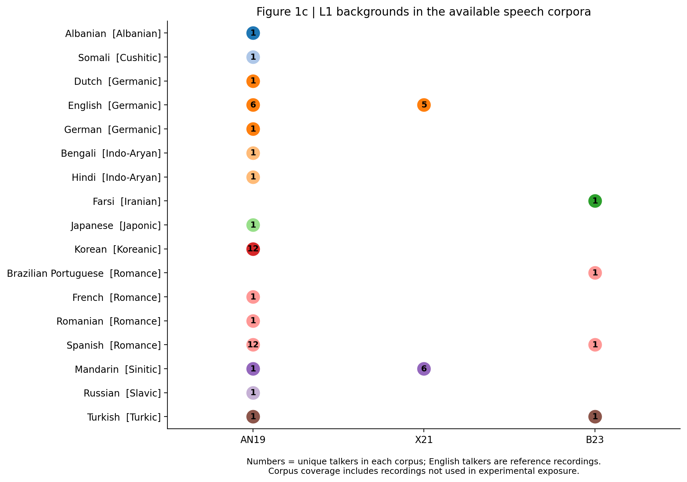
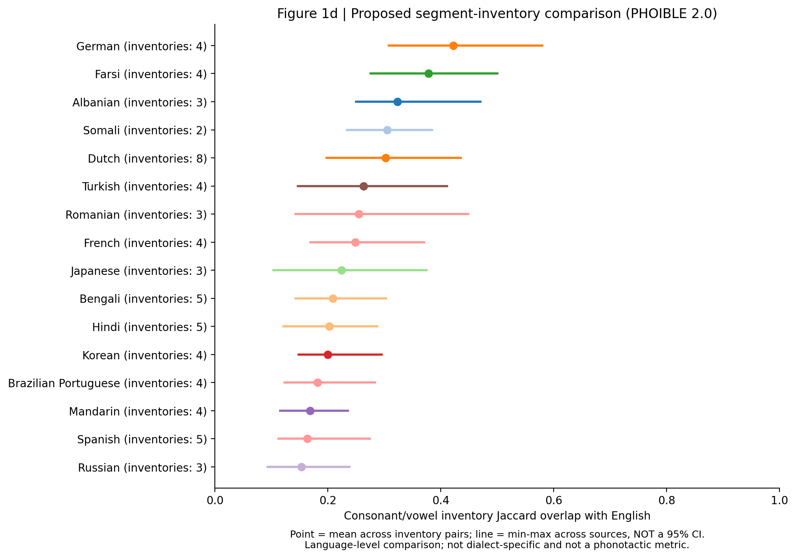
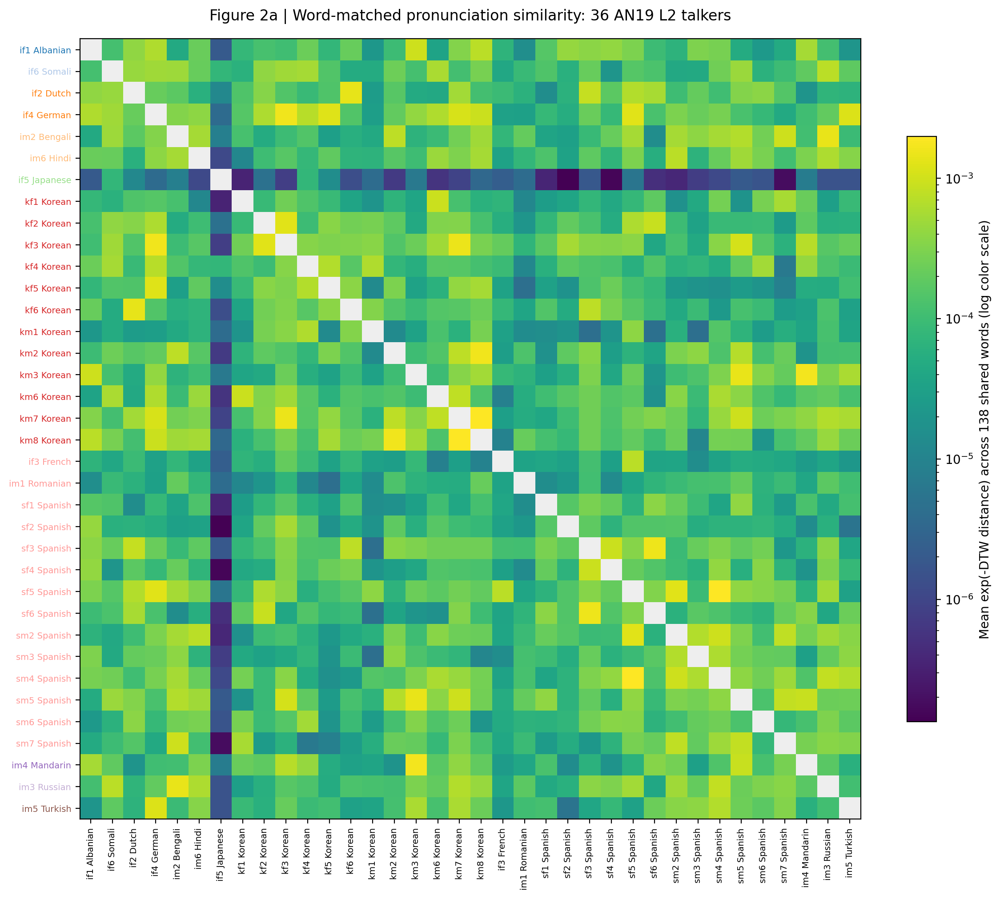
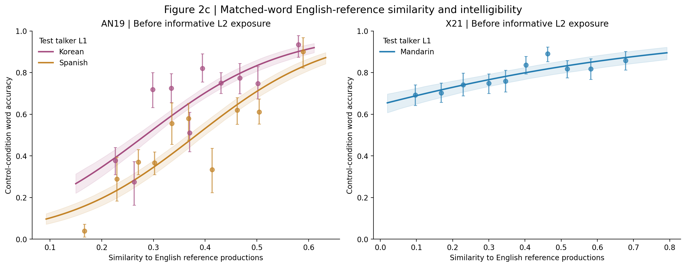
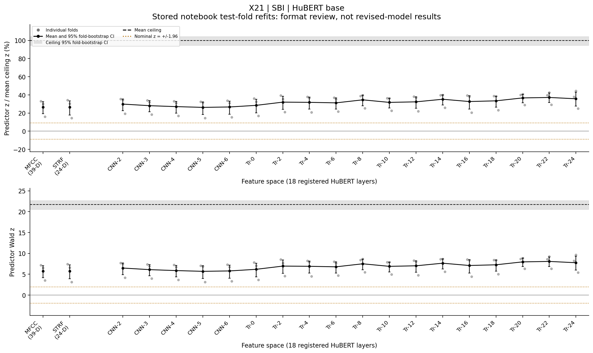
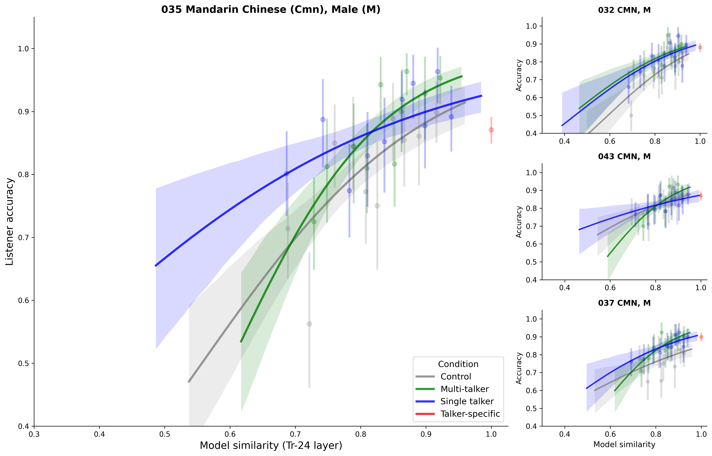
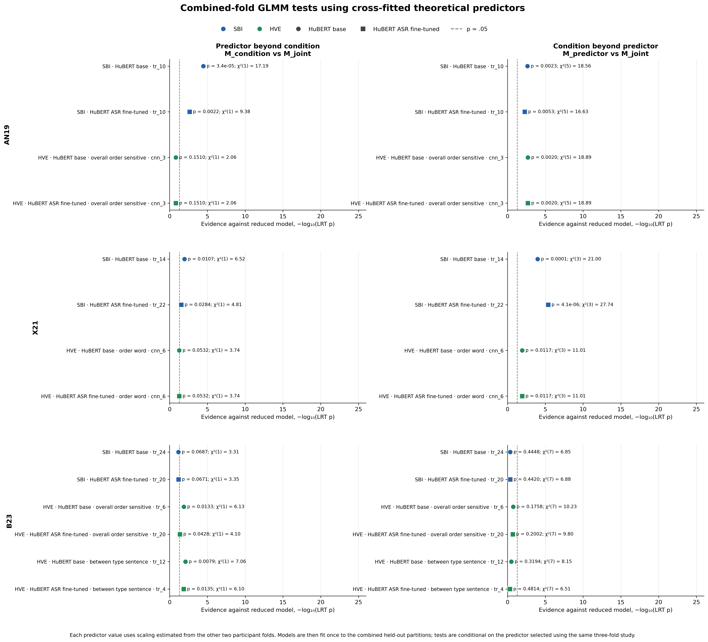

# Cross-talker generalization: analysis and figure update

Following our September 1 meeting and your email, I have updated the figures and summarized where the analyses stand. I have organized this around the five points you raised.

1. **Optimization and reporting.** I have kept predictor-only likelihood and predictor z separate. For SBI, I show z across layers with three-fold intervals and a behavioral ceiling, alongside likelihood evaluation and both condition comparisons. I retain Tr-24 as the common-layer summary we discussed.
2. **Consistent figures.** I have brought together the layerwise z plots, conditional S-curves and model comparisons. I still need to recalculate a compatible ceiling for the revised HVE fits; the older notebook ceiling comes from a different fitting procedure.
3. **Figures 1 and 2.** I have added the Tr-24 speech trajectories, language coverage, a candidate PHOIBLE comparison, the 36-L2-talker matrix, and AN19/X21 control-condition curves. I have left 2b/2d open because AN19 has no existing phone-level labels.
4. **AN19 acoustic controls.** I found a coordinate-scaling mismatch between the component analysis and the full baseline. I need to rerun them with the same preprocessing before interpreting which components account for the strong AN19 result.
5. **Exposure understanding.** I would next like to test whether recognizing particular exposure sounds or words helps with related test words, while separating this from differences in listeners' overall ability.

Below I explain the figures and the remaining questions. I have included the new figures as PNG/SVG files with their underlying tables.

---

## Figure 1a-b: from speech to latent trajectories

I used "A boy fell from a window," spoken by English-L1 male talker 055 in X21, to illustrate the transformation. The Tr-24 representation contains 67 frames with 1,024 dimensions before reduction and three afterwards. I used the existing t-SNE fit over all 660 corpus sentence segments (seed 42).

The lower row follows the sentence, the word "fell", and its segments F, EH1 and L using the available interval annotations. I kept all trajectories in the same coordinates and axis limits, without per-token normalization or smoothing. EH1 occupies one frame and appears as a point. Circles mark starts; crosses mark ends.

---

## Figure 1c: L1 backgrounds across the datasets

I combined the L1 backgrounds across the three datasets, using colors for broad language branches. I changed the AN19 display labels "Indian" and "Chinese" to Hindi and Mandarin, following Table I of the original study. This gives 17 distinct L1 labels. Numbers indicate talkers in the available speech corpora, including English references; they do not indicate listener counts or exposure conditions.

---

## Figure 1d: phonological inventory similarity to English

As a starting point, I calculated consonant/vowel inventory overlap with English using PHOIBLE 2.0. I used Jaccard similarity for each inventory pair and averaged over all available pairs. Points show these means; lines show the minimum and maximum across sources, not 95% confidence intervals.

This captures shared segment inventories, but not phonotactics or speaker-specific dialect differences, and it depends on transcription conventions. I would like your view on whether this narrower comparison is useful for 1d or whether we should add separate suprasegmental and phonotactic measures.

Source: Moran & McCloy (eds.), [PHOIBLE 2.0](https://phoible.org/), 2019, v2.0 release, CC BY-SA 3.0.

---

## Figure 2a: pronunciation similarity among 36 AN19 L2 talkers

I selected the 36 L2 talkers from the original 42-talker matrix and grouped them by L1 and language branch. I use the six English talkers as references in Figure 2c instead.

Each cell averages exp(-DTW distance) over the same 138 shared words, with equal weight per word. I retained the existing Tr-24 base-model distances, tau = 2 and mean-sequence-length normalization. The color scale is logarithmic, and I have masked self-comparisons.

---

## Figure 2c: English-reference similarity and control intelligibility

I compared each test word with the same word from six English talkers in AN19 or five in X21, averaging distances equally over reference talkers. For X21, I extracted word intervals from the sentence features. I converted distance to similarity using exp(-d/s), where s is the dataset median distance across unique matched targets, without using accuracy to choose the scale.

I see a positive association in all three accent groups. Points summarize ten within-accent quantile bins; curves are descriptive logistic fits. Both have 95% participant-bootstrap intervals (1,000 resamples), conditional on these items and talkers. These control-only curves are separate from the cross-validated GLMM tests.

I included 1,880/1,920 AN19 responses from 40 participants and all 4,117 X21 responses from 80 participants. I temporarily excluded 40 AN19 "wave" responses: the corresponding English hw74 recordings exist but are labeled "wade", while the L2 recordings say "wave". I need to resolve the spoken-word identity before treating these as same-word comparisons.

---

## SBI: z across layers

I have put MFCC and STRF first, followed by the HuBERT layers. The three points show the folds, with their mean and 95% fold-bootstrap interval. In the upper panel, I set the mean ceiling to 100% and show its interval in gray; the lower panel gives raw z.

For this X21 example, I used the existing notebook results, where GLMMs were refitted within each test fold. These are not the revised-model fits or held-out prediction scores, and the normalized z is not a percentage of variance explained. The reference lines currently use nominal z = +/-1.96. Before adding the Bonferroni line in the draft caption, I would like to agree which tests belong in the correction. The other SBI and HVE profiles are in the [z gallery](../z_value_review/index.html).

---

## X21: similarity and accuracy by condition

I retained the condition-specific curves for each X21 test talker from my earlier notebook. Here, similarity is between exposure and test speech, unlike the English-reference similarity in Figure 2c.

The curves help show how the conditions differ at comparable similarity values. I use the joint-model comparison on the next page to test whether condition adds information beyond the theoretical predictor. The pooled-bin companion and source tables are in the August 21 package.

---

## Does SBI/HVE add beyond condition, and vice versa?

On the left, I compare the joint model with the condition-only model to ask whether SBI/HVE adds information. On the right, I compare the joint model with the predictor-only model to ask whether condition adds information. I keep the theoretical predictor unchanged between these comparisons.

These are the September 1 likelihood-ratio tests fitted to the combined test folds using cross-fitted predictor values. Because I selected layers and methods using the same study, I treat these p-values as exploratory, alongside the held-out prediction results. This figure shows the selected layers, not the common Tr-24 summary.

---

## What I still need to do

| Analysis | What I have | Next step |
|---|---|---|
| Figure 2b | Word features, target transcripts, English references | Agree whether to add phone annotations and how to select phonemes independently of the results |
| Figure 2d | Written listener responses and the full caption | Use 2b deviations; align response errors and define minimal-pair neighbors with a pronunciation lexicon |
| Figure 1d | PHOIBLE inventory comparison | Discuss whether to extend beyond segment inventories |
| Updated z and ceiling | Revised HVE coefficients and older notebook z tables | Recalculate compatible ceilings and obtain current SBI coefficients for every registered layer |
| Objective comparison | Likelihood-based and z-based selection code | Compare B23 methods on the same participants, or keep the 97- and 168-participant sets separate |
| Acoustic components | Full baselines and initial component results | Rerun with matching coordinate scaling and response rows |

I do not have phone-level labels for AN19, so I have put 2b/2d on hold. To pursue them, I would need to create and check the alignments first, then define the response-error and lexical-neighbor measures for 2d. I would like to discuss whether this additional annotation work should be a priority.

I also need to check the remaining ablations against the latest Overleaf version: ASR fine-tuning, architecture, full versus reduced representations, UMAP, PCA and similarity measures. I have kept the detailed source notes in [SOURCE_REVIEW.md](SOURCE_REVIEW.md) and the remaining tasks in TODO.
