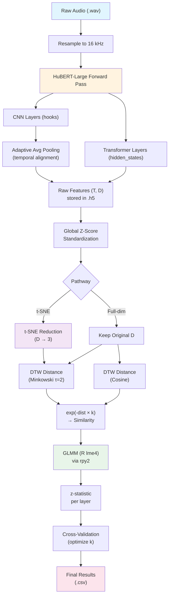

# Similarity-Based Inferences Predict Cross-Talker Generalization During Human Speech Perception

## Technical Documentation

---

## 1. Project Overview

This project investigates whether **similarity-based inferences** — as computed from deep speech representations — can predict how well human listeners generalize their speech perception abilities across different talkers. The core hypothesis is that listeners who are exposed to speech from certain talkers during a training phase will better understand a novel test talker if that test talker sounds *more similar* to the training talkers.

The pipeline consists of the following stages:

1. **Human behavioral data**: Collect and preprocess experimental data from three published speech perception studies.
2. **Feature extraction**: Use the HuBERT model (a self-supervised speech representation model) to simulate auditory processing and extract layer-wise representations from speech audio.
3. **Dimensionality reduction**: Apply t-SNE to project high-dimensional representations into a 3-dimensional space.
4. **Similarity computation**: Calculate pairwise talker similarity using Dynamic Time Warping (DTW) with Minkowski distance, then transform distances into similarity scores via an exponential decay function.
5. **Statistical modeling**: Fit Generalized Linear Mixed Models (GLMMs) to test whether the computed similarity predicts human behavioral accuracy.
6. **Variability analysis**: Compute various variability measures across linguistic units to characterize the acoustic diversity of the exposure signal.
7. **Baseline comparisons**: Compare HuBERT-based representations against traditional acoustic features (MFCC and STRF).

---

## 2. Human Behavioral Data

### 2.1 Datasets

The project uses behavioral data from three published speech perception experiments. Each experiment exposes human listeners to accented speech during a training phase and then tests their comprehension of (potentially novel) talkers during a test phase. The three datasets differ in their linguistic granularity, experimental conditions, and accents studied.

| Dataset | Reference | Experiment ID | Item Granularity | Accents | Talkers |
|---------|-----------|---------------|-----------------|---------|---------|
| **Alexander & Nygaard (2019, Exp. 2)** | AN19 | `AN19` | **Word** only | L1-English, L1-Korean, L1-Spanish | Multiple per accent group |
| **Xie, Liu & Jaeger (2021, Exp. 1a)** | X21 | `X21` | **Sentence**, **Word**, **Phoneme** | L1-English (ENG), L1-Mandarin (CMN) | 11 talkers (6 CMN, 5 ENG) |
| **Bradlow, Bassard & Paller (2023)** | B23 | `B23` | **Sentence** only | Portuguese (PBR), Farsi (FAR), Turkish (TUR), Spanish (SPA) | 4 talkers (1 per accent) |

#### 2.1.1 Alexander & Nygaard 2019 (AN19)

- **Granularity**: Word-level only.
- **Structure**: Each observation corresponds to one isolated word transcription. Each item ID has the format `AN19.{accent_id}.{talker_id}.W{number}`.
- **Conditions**: Listeners experience either single-accent or multi-accent exposure, and are tested on within-accent or cross-accent generalization.
- **Sound stimuli**: Organized by accent group into four directories: `L1-English`, `L1-Korean L2-English`, `L1-Spanish L2-English`, `L1-mixed L2-English`. Each directory contains `.wav` files paired with no TextGrid annotations (words are isolated recordings).

#### 2.1.2 Xie, Liu & Jaeger 2021 (X21)

- **Granularity**: The dataset supports **sentence**, **word**, and **phoneme** levels.
  - **Sentence**: Full utterance-level annotations from Praat TextGrid Tier 0.
  - **Word**: Keyword-level annotations from TextGrid Tier 1 (keyword boundaries within sentences).
  - **Phoneme**: Fine-grained phoneme-level annotations from TextGrid Tier 2 (phone boundaries within keywords, excluding silence marks `sp`).
- **Structure**: Items are stored at the word level. Each item ID has the format `X21.{accent_id}.{talker_id}.S{sentence_number}.W{keyword}`.
- **Talkers**: 11 talkers — 6 Mandarin-accented (CMN) and 5 native English (ENG). Each talker has a corresponding `.wav` + `.TextGrid` file pair.
- **Sentence subset**: Only specific sentences are used: indices `[0–10, 12–16]` (Set 1) and `[17–22, 24–31, 37, 40]` (Set 2), yielding 32 sentences total.

#### 2.1.3 Bradlow, Bassard & Paller 2023 (B23)

- **Granularity**: Sentence-level only.
- **Structure**: Items stored at the sentence level with scoring based on correctly transcribed keywords within each sentence. The response scoring is a count (not binary): `response_correct` and `response_incorrect` can exceed 1 because multiple keywords per sentence are scored.
- **Talkers**: 4 talkers from different L1 backgrounds (Portuguese, Farsi, Turkish, Spanish). Each talker has two recording halves (HT1, HT2) with `.wav` + `.TextGrid` file pairs.

### 2.2 Preprocessed Data Format

All three datasets are standardized into a common CSV format (`*-behavioral-data.csv`) with the following key columns:

| Column | Description |
|--------|-------------|
| `experiment_id` | AN19, B23, or X21 |
| `participant_id` | Unique listener identifier |
| `exposure_condition.accent` | control / single / multi |
| `exposure_condition.talker` | none / single / multi |
| `test_condition.accent_generalization` | control / cross-accent / within-accent |
| `test_condition.talker_generalization` | none / cross-talker / within-talker |
| `exposure_talkers`, `test_talkers` | Alphabetically sorted talker lists |
| `phase` | exposure / test |
| `item_id` | Unique speech recording identifier |
| `response_correct`, `response_incorrect` | Counts of correct/incorrect responses |

---

## 3. Feature Extraction

### 3.1 HuBERT Model

We use the **HuBERT-Large** model as a computational proxy for human auditory processing. HuBERT (Hidden-Unit BERT) is a self-supervised speech representation learning model that learns speech representations by predicting cluster assignments of masked audio segments.

Two model variants are used:

| Variant | Hugging Face ID | Description |
|---------|----------------|-------------|
| **Base (pre-trained)** | `facebook/hubert-large-ll60k` | Pre-trained on 60k hours of Libri-Light |
| **Fine-tuned** | `facebook/hubert-large-ls960-ft` | Fine-tuned on 960h LibriSpeech for ASR |

### 3.2 Layer Selection

The HuBERT-Large architecture consists of a **CNN feature encoder** (7 convolutional layers, indexed 0–6) followed by a **Transformer encoder** (24 layers, indexed 0–24 where layer 0 is the projection of the CNN output).

We extract representations from the following layers:
- **CNN layers**: `[2, 3, 4, 5, 6]`
- **Transformer layers**: `[0, 2, 4, 6, 8, 10, 12, 14, 16, 18, 20, 22, 24]`

This yields **18 layers** in total (5 CNN + 13 Transformer), each providing a different level of speech representation.

### 3.3 CNN Layer Temporal Alignment (Adaptive Average Pooling)

A critical preprocessing step is required because **different CNN layers produce outputs with different temporal resolutions**. The early CNN layers preserve more temporal frames (higher resolution), while deeper layers progressively downsample the signal.

To align all CNN layers to a common temporal dimension, we apply **1D Adaptive Average Pooling**:

1. Identify the target temporal dimension `T_target` from the **last CNN layer** (layer 6), which matches the temporal resolution entering the Transformer encoder.
2. For each CNN layer $i$ with temporal output $T_i$:
   - If $T_i \neq T_{\text{target}}$: apply `torch.nn.functional.adaptive_avg_pool1d(feat, T_target)` to downsample.
   - If $T_i = T_{\text{target}}$: keep as-is.
3. All CNN outputs are transposed from `(B, C, T)` to `(T, C)` to match the Transformer output format.

This ensures that all layers produce feature sequences with identical temporal resolution, enabling consistent downstream comparison.

Implementation: [`feature_utils.py :: _extract_selected_layers()`](file:///c:/Users/Alex/Documents/GitHub/Similarity-based%20inferences%20predict%20cross-talker%20generalization%20during%20human%20speech%20perception/preprocessing/feature_utils.py#L73-L104)

### 3.4 CNN Hook Registration

CNN layer activations are captured using **PyTorch forward hooks** registered on `model.feature_extractor.conv_layers`. Each hook captures the output tensor during the forward pass and stores it in a dictionary indexed by layer number.

Implementation: [`feature_utils.py :: _register_cnn_hooks()`](file:///c:/Users/Alex/Documents/GitHub/Similarity-based%20inferences%20predict%20cross-talker%20generalization%20during%20human%20speech%20perception/preprocessing/feature_utils.py#L107-L122)

### 3.5 Transformer Layer Extraction

Transformer layer activations are obtained directly from the model's `hidden_states` output (enabled via `output_hidden_states=True`). Each hidden state has shape `(1, T, D)` where `D` is the hidden dimension (1024 for HuBERT-Large).

### 3.6 Audio Preprocessing

All audio is resampled to **16 kHz** (the native sample rate expected by HuBERT) using `librosa` or `torchaudio.functional.resample`.

### 3.7 Feature Storage (HDF5)

Extracted features are stored in HDF5 (`.h5`) files with two structural layouts:

1. **Raw features** (`*_features.h5`): Organized as `[speaker_id / item_id / layer_key]`, where each leaf is a `(T, D)` NumPy array.
2. **t-SNE reduced features** (`*_tsne_3d.h5`): Organized as `[layer_key / speaker_id / item_id]`, where each leaf is a `(T, 3)` NumPy array.

The data loader automatically detects which layout is used by checking whether `layer_key` is a root-level key.

---

## 4. Dimensionality Reduction (t-SNE)

### 4.1 Motivation

The raw feature dimensionality from HuBERT-Large is very high (up to 1024 dimensions for Transformer layers, varying for CNN layers). To enable tractable similarity computation, we apply **t-SNE (t-distributed Stochastic Neighbor Embedding)** to reduce features to 3 dimensions.

### 4.2 t-SNE Configuration

| Parameter | Value |
|-----------|-------|
| `n_components` | **3** |
| `random_state` | **42** |
| `n_jobs` | **1** (per worker; parallelized across layers) |

### 4.3 Procedure

1. For each layer, **all frames across all speakers and items** are vertically stacked (`np.vstack`) into a single matrix of shape `(N_total_frames, D)`.
2. t-SNE is fit on this global matrix, projecting all frames jointly to `(N_total_frames, 3)`.
3. The reduced frames are then split back into per-speaker, per-item segments using stored metadata (speaker, item, and frame count).
4. Layer-wise t-SNE computation is parallelized across up to **30 CPU cores** using `joblib.Parallel`.

Implementation: [`feature_utils.py :: process_single_layer()`](file:///c:/Users/Alex/Documents/GitHub/Similarity-based%20inferences%20predict%20cross-talker%20generalization%20during%20human%20speech%20perception/preprocessing/feature_utils.py#L34-L62)

### 4.4 Alternative: Full-Dimensional Computation

We also tested computing similarity directly on the **original high-dimensional features** (without t-SNE reduction). This approach is explored in the results files:
- `nygaard19_glmm_results_hubert_full_dim.csv`
- `xie21_glmm_results_hubert_full_dim.csv`

This serves as a comparison to validate whether t-SNE introduces beneficial or detrimental information loss.

---

## 5. Standardization and Normalization

### 5.1 Global Z-Score Standardization

Before computing distances, feature representations are globally standardized using **Z-score normalization**:

$$
x_{\text{std}} = \frac{x - \mu}{\sigma + \epsilon}
$$

where:
- $\mu$ is the global mean across **all frames** (all speakers, all items) for each feature dimension.
- $\sigma$ is the global standard deviation.
- $\epsilon = 10^{-8}$ is a small constant for numerical stability.

This is applied **per feature dimension** (column-wise), ensuring all dimensions contribute equally to distance calculations.

Implementation: [`project_utils.py :: standardization()`](file:///c:/Users/Alex/Documents/GitHub/Similarity-based%20inferences%20predict%20cross-talker%20generalization%20during%20human%20speech%20perception/glmm_prediction/project_utils.py#L113-L128) and [`feature_utils.py :: standardize_features()`](file:///c:/Users/Alex/Documents/GitHub/Similarity-based%20inferences%20predict%20cross-talker%20generalization%20during%20human%20speech%20perception/preprocessing/feature_utils.py#L9-L21)

### 5.2 Instance Normalization

An alternative normalization variant applies standardization **per word instance** (rather than globally). This was explored for the Nygaard dataset to assess whether local normalization (0-mean, unit-variance per word token) affects downstream results:

$$
x_{\text{inst}} = \frac{x - \mu_{\text{word}}}{\sigma_{\text{word}} + \epsilon}
$$

This produces separate feature files (`*_inst_norm.h5`) and corresponding GLMM results (`*_inst_norm.csv`).

### 5.3 Similarity Predictor Scaling in GLMM (Nygaard)

For the Nygaard dataset GLMM, the similarity predictor is additionally scaled using **Gelman's (2008) standardization** to improve convergence:

$$
\text{similarity\_scaled} = \frac{\text{similarity} - \mu_{\text{sim}}}{2 \times \sigma_{\text{sim}}}
$$

This divides by twice the standard deviation, which places continuous predictors on a comparable scale to binary predictors in the mixed model. This scaling is computed on the training split and applied consistently to both the training and test/validation splits using the **training set statistics** (preventing data leakage).

Implementation: [`project_utils.py :: fit_and_evaluate_split_nygaard()`](file:///c:/Users/Alex/Documents/GitHub/Similarity-based%20inferences%20predict%20cross-talker%20generalization%20during%20human%20speech%20perception/glmm_prediction/project_utils.py#L736-L839)

---

## 6. Similarity Computation

This is the core computational pipeline of the project.

### 6.1 Overview

The goal is to compute the **perceptual similarity** between the talkers a listener was exposed to during training and the novel test talker. This similarity is hypothesized to predict the listener's comprehension accuracy on the test talker.

### 6.2 Word-Level Feature Alignment

For the Xie and Nygaard datasets, features are extracted at the **sentence level** from HuBERT but must be segmented to the **word level** for similarity computation. This segmentation uses Praat TextGrid annotations:

1. Parse the TextGrid to obtain word boundaries (start time, end time) within each sentence.
2. Convert time boundaries to frame indices using proportional mapping:
   $$
   \text{frame\_start} = \text{round}\left(\frac{T_{\text{total\_frames}} \times (t_{\text{word\_start}} - t_{\text{sentence\_start}})}{t_{\text{sentence\_end}} - t_{\text{sentence\_start}}}\right)
   $$
3. Extract the feature subsequence: `features[frame_start : frame_end, :]`.

Implementation: [`project_utils.py :: create_set()`](file:///c:/Users/Alex/Documents/GitHub/Similarity-based%20inferences%20predict%20cross-talker%20generalization%20during%20human%20speech%20perception/glmm_prediction/project_utils.py#L131-L178)

### 6.3 Dynamic Time Warping (DTW)

Since different instances of the same word have different durations (and hence different numbers of frames), we use **Dynamic Time Warping (DTW)** to compute the distance between two sequences.

#### 6.3.1 DTW Algorithm

Given two feature sequences $\mathbf{X} = \{x_1, x_2, \ldots, x_n\}$ and $\mathbf{Y} = \{y_1, y_2, \ldots, y_m\}$, the DTW algorithm computes a cost matrix $D$ as follows:

$$
D[i, j] = \text{cost}(i, j) + \min\left(D[i-1, j],\; D[i, j-1],\; D[i-1, j-1]\right)
$$

where $D[0, 0] = 0$ and all other boundary values are $+\infty$.

The final DTW distance is **normalized** by the average length of the two sequences:

$$
d_{\text{DTW}}(\mathbf{X}, \mathbf{Y}) = \frac{D[n, m]}{(n + m) / 2}
$$

This normalization prevents the distance from being biased toward longer sequences.

Implementation: [`project_utils.py :: dtw_raw_distance()`](file:///c:/Users/Alex/Documents/GitHub/Similarity-based%20inferences%20predict%20cross-talker%20generalization%20during%20human%20speech%20perception/glmm_prediction/project_utils.py#L98-L110)

#### 6.3.2 Frame-Level Cost Functions

Two frame-level cost functions are implemented, selectable via `distance_type`:

**Option 0: Weighted Minkowski Distance (Default)**

$$
\text{cost}(x_t, y_t) = \left(\sum_{m=1}^{D} w \cdot |x_{t,m} - y_{t,m}|^{\tau}\right)^{1/\tau}
$$

- Default parameters: $\tau = 2.0$ (Euclidean), $w = 1$.
- Compiled with `@njit(nogil=True)` from Numba for performance.

**Option 1: Cosine Distance**

$$
\text{cost}(x_t, y_t) = 1 - \frac{x_t \cdot y_t}{\|x_t\| \cdot \|y_t\|}
$$

- Returns $1.0$ if either vector has zero magnitude.
- Also compiled with Numba.

Implementation: [`project_utils.py :: weighted_minkowski()`](file:///c:/Users/Alex/Documents/GitHub/Similarity-based%20inferences%20predict%20cross-talker%20generalization%20during%20human%20speech%20perception/glmm_prediction/project_utils.py#L842-L848) and [`project_utils.py :: cosine_distance()`](file:///c:/Users/Alex/Documents/GitHub/Similarity-based%20inferences%20predict%20cross-talker%20generalization%20during%20human%20speech%20perception/glmm_prediction/project_utils.py#L85-L95)

### 6.4 Distance Aggregation

For a given listener, the distance from the test talker to the training talkers is computed as follows:

1. Identify the **shared words** between the training talkers and the test talker.
2. For each shared word, compute DTW distance between the test talker's instance and **each training talker's instance**.
3. **Average** all per-word DTW distances to obtain a single aggregate distance:

$$
d_{\text{agg}} = \frac{1}{|W|} \sum_{w \in W} \frac{1}{|T_w|} \sum_{t \in T_w} d_{\text{DTW}}(\text{test}_w, \text{train}_{t,w})
$$

where $W$ is the set of shared words and $T_w$ is the set of training talkers producing word $w$.

Implementation: [`project_utils.py :: precompute_layer_distances()`](file:///c:/Users/Alex/Documents/GitHub/Similarity-based%20inferences%20predict%20cross-talker%20generalization%20during%20human%20speech%20perception/glmm_prediction/project_utils.py#L181-L224)

### 6.5 Exponential Transformation (Distance → Similarity)

Raw DTW distances are transformed into similarity scores using an **exponential decay function**:

$$
\text{similarity} = \exp(-d_{\text{raw}} \times k)
$$

where $k > 0$ is a **scaling parameter** that controls the sensitivity of similarity to distance. A larger $k$ makes the similarity decay more steeply with distance.

The parameter $k$ is **optimized** through cross-validation to maximize the predictive power of the GLMM (see Section 7).

### 6.6 Alternative Similarity Methods Tested

We systematically evaluated different combinations of feature representations and distance metrics. The full set of tested conditions includes:

| Condition | Feature Space | Distance Metric | t-SNE | Results File |
|-----------|--------------|-----------------|-------|--------------|
| **HuBERT + t-SNE + Minkowski (default)** | 3D t-SNE | DTW + Minkowski ($\tau=2$) | Yes | `*_glmm_results_hubert.csv` |
| **HuBERT + t-SNE + Minkowski (fine-tuned)** | 3D t-SNE | DTW + Minkowski ($\tau=2$) | Yes | `*_glmm_results_hubert_ft.csv` |
| **HuBERT + Full-dim + Minkowski** | Original 1024D | DTW + Minkowski ($\tau=2$) | No | `*_glmm_results_hubert_full_dim.csv` |
| **HuBERT + Full-dim + Cosine** | Original 1024D | DTW + Cosine | No | `*_glmm_results_hubert_cos_full_dim.csv` |
| **HuBERT + Full-dim + Cosine (fine-tuned)** | Original 1024D | DTW + Cosine | No | `*_glmm_results_hubert_cos_full_dim_ft.csv` |
| **HuBERT + t-SNE + Instance Norm** | 3D t-SNE (inst norm) | DTW + Minkowski ($\tau=2$) | Yes | `*_glmm_results_hubert_inst_norm.csv` |
| **MFCC Baseline** | 39D (13 MFCC + Δ + ΔΔ) | DTW + Minkowski | No | `*_glmm_results_baseline.csv` |
| **STRF Baseline** | 24D | DTW + Minkowski | No | `*_glmm_results_baseline.csv` |

---

## 7. Statistical Modeling: Generalized Linear Mixed Models (GLMMs)

### 7.1 Overview

After computing similarity scores for each layer of HuBERT (and baselines), we fit **Generalized Linear Mixed Models (GLMMs)** to test whether similarity predicts human speech comprehension accuracy. The key output metric is the **Wald z-statistic** of the similarity predictor, which quantifies the strength of the similarity–accuracy relationship at each layer.

GLMMs are fitted using R's `lme4::glmer` function, interfaced via Python's `rpy2` package.

### 7.2 GLMM for Xie (X21) Dataset

#### Model Formula

```r
glmer(cbind(numCorrect, numIncorrect) ~ 1 + similarity + (1 | SentenceID / Keyword) + (1 | TestTalkerID),
      data = data, family = binomial(link = "logit"),
      control = glmerControl(optimizer = "bobyqa", optCtrl = list(maxfun = 10000)))
```

#### Components
- **Response**: Binomial outcome — `cbind(numCorrect, numIncorrect)` per aggregated observation.
- **Fixed effect**: `similarity` (the exponential-transformed DTW distance).
- **Random effects**:
  - `(1 | SentenceID / Keyword)`: Nested random intercept — keywords nested within sentences.
  - `(1 | TestTalkerID)`: Random intercept for test talker identity.
- **Link**: Logit.
- **Optimizer**: BOBYQA (bounded optimization by quadratic approximation), max 10,000 function evaluations.

#### Data Aggregation

Before fitting, data is aggregated by `[Keyword, Condition2, TrainingTalkerID, TestTalkerID, SentenceID]`:
- `numCorrect` = count of correct responses.
- `numIncorrect` = count of incorrect responses.
- `similarity` = mean similarity across observations in the group.

### 7.3 GLMM for Nygaard (AN19) Dataset

The Nygaard dataset uses a different GLMM structure because of its different experimental design.

#### Model Formula

```r
glmer(cbind(numCorrect, numIncorrect) ~ similarity_scaled + (1 + similarity_scaled | SubjectID),
      data = data, family = binomial(link = "logit"),
      control = glmerControl(optimizer = "bobyqa", optCtrl = list(maxfun = 1e5)))
```

#### Key Differences from X21
- **Subject-level random slope**: `(1 + similarity_scaled | SubjectID)` — allows both the intercept and the effect of similarity to vary across participants.
- **Similarity scaling**: Uses Gelman's (2008) standardization (see Section 5.3).
- **No sentence/keyword nesting**: The Nygaard dataset has isolated word stimuli (no sentence structure).

### 7.4 K-Fold Cross-Validation and Parameter Optimization

The scaling parameter $k$ in the exponential transformation is optimized via cross-validation:

#### For the Xie Dataset

1. **3-fold stratified split** (`StratifiedKFold(n_splits=3, shuffle=True, random_state=42)`) based on `TrainingTestSet_Condition2_TestTalkerID`.
2. For each fold:
   - **Optimize $k$**: Use `scipy.optimize.minimize_scalar` (bounded method, range $[0.001, 5.0]$) on the training set. The objective is to minimize $-z_{\text{train}}$ (i.e., maximize the z-statistic).
   - Record the best $k$ for each fold.
3. Compute the **mean $k$** across all folds.
4. Re-evaluate the model on each fold using the mean $k$ (**corrected evaluation**), preventing overfitting to fold-specific optima.

#### For the Nygaard Dataset

1. **3-fold split** across participants.
2. For each test fold:
   - Designate one fold as **train**, one as **validation**, one as **test** (rotating).
   - **Optimize $k$** using `optuna` (Bayesian TPE sampler, 20 trials, seed=42) with an **L2-regularized objective**:
     $$
     \mathcal{L} = -z_{\text{target}} + \alpha \cdot k^2
     $$
     where $\alpha = 0.1$ is the regularization coefficient, preventing large $k$ values.
   - The search range for $k$ is $[0.001, 2.0]$.
3. Apply the best $k$ to the held-out test fold.

### 7.5 Output Metrics

For each layer, the following metrics are recorded across folds:

| Metric | Description |
|--------|-------------|
| `z_train` | Wald z-statistic on the training set |
| `z_test` | Wald z-statistic on the held-out test set |
| `k` | Optimal (or mean) scaling parameter |
| `poll_train` | Per-observation pseudo-log-likelihood on training set: $\frac{\log\mathcal{L}_{\text{train}}}{N_{\text{train}}}$ |
| `poll_test` | Per-observation pseudo-log-likelihood on test set: $\frac{\log\mathcal{L}_{\text{test}}}{N_{\text{test}}}$ |
| `optimism` | Overfitting metric: $\frac{\text{poll\_train} - \text{poll\_test}}{|\text{poll\_train}|}$ |

### 7.6 Behavioral Noise Ceiling

To contextualize the z-statistics, a **behavioral noise ceiling** is computed using the **Jaeger Self-Predictability Method**:

1. From the training data, compute the **log-odds** of a correct response for each unique item (word × talker):
   $$
   \text{logodds} = \log\left(\frac{p}{1-p}\right)
   $$
2. Scale using Gelman's (2008) standardization: $\text{logodds\_scaled} = \frac{\text{logodds} - \mu}{2\sigma}$ (computed on the training split).
3. Apply to the test data and fit a GLMM with `logodds_scaled` as predictor.
4. The resulting z-statistic represents the **ceiling** — the maximum achievable z using observed human behavior as the predictor.

This ceiling accounts for irreducible noise in human responses and avoids cross-fold data leakage.

### 7.7 Parallel Execution

All layer-wise GLMM computations are parallelized using `joblib.Parallel` with the `loky` backend (or `prefer='threads'`). Each layer's pipeline (load data → standardize → compute DTW → optimize $k$ → fit GLMM) runs independently.

Implementation: [`project_utils.py :: run_analysis_pipeline_v4()`](file:///c:/Users/Alex/Documents/GitHub/Similarity-based%20inferences%20predict%20cross-talker%20generalization%20during%20human%20speech%20perception/glmm_prediction/project_utils.py#L643-L666)

---

## 8. Baseline Features

### 8.1 MFCC (Mel-Frequency Cepstral Coefficients)

MFCC features serve as a **traditional acoustic baseline** representing spectral information in a compact form.

#### Extraction Configuration

| Parameter | Value |
|-----------|-------|
| Sample rate | 16,000 Hz |
| `n_mfcc` | 13 |
| `n_fft` | 400 (25ms window) |
| `hop_length` | 160 (10ms hop) |
| `n_mels` | 23 |
| `center` | False |

#### Processing Steps
1. Extract 13 MFCCs from each audio segment using `torchaudio.transforms.MFCC`.
2. Compute **delta** (first derivative) features: $\Delta\text{MFCC}$.
3. Compute **delta-delta** (second derivative) features: $\Delta\Delta\text{MFCC}$.
4. Concatenate: $[\text{MFCC}; \Delta\text{MFCC}; \Delta\Delta\text{MFCC}]$, yielding a **39-dimensional** representation.
5. Transpose from `(D, T)` to `(T, D)`.

Implementation: [`project_utils.py :: extract_mfcc_features()`](file:///c:/Users/Alex/Documents/GitHub/Similarity-based%20inferences%20predict%20cross-talker%20generalization%20during%20human%20speech%20perception/glmm_prediction/project_utils.py#L305-L358)

### 8.2 STRF (Spectro-Temporal Receptive Field)

STRF features simulate processing in the **primary auditory cortex**, where neurons are tuned to specific spectro-temporal modulation patterns.

#### Kernel Construction

STRFs are modeled as complex 2D Gabor filters applied to log-mel spectrograms. The kernels are parameterized by:

| Parameter | Values |
|-----------|--------|
| Temporal rates ($r$) | `[2, 4, 8, 16]` Hz |
| Spectral scales ($s$) | `[0.25, 0.5, 1.0]` cycles/octave |
| Directions ($d$) | `[+1, −1]` (upward/downward sweeps) |
| Temporal span | $[-0.2, 0.2]$ seconds (41 steps) |
| Frequency span | $[-1, 1]$ (21 steps) |

This produces $4 \times 3 \times 2 = 24$ complex kernels, yielding a **24-dimensional** representation.

#### Kernel Formula

Each kernel consists of an envelope multiplied by a sinusoidal phase:

$$
\text{Envelope} = \exp\left(-0.5 \left[(T \cdot r \cdot 1.5)^2 + (F \cdot s \cdot 1.5)^2\right]\right)
$$

$$
\text{Phase} = 2\pi (r \cdot T + d \cdot s \cdot F)
$$

$$
K_{\text{real}} = \text{Envelope} \cdot \cos(\text{Phase}), \quad K_{\text{imag}} = \text{Envelope} \cdot \sin(\text{Phase})
$$

All kernels are **mean-centered** (zero-mean) to remove DC bias.

#### Extraction Process

1. Compute **log-mel spectrogram**: `torch.log(mel_spectrogram + 1e-6)` with 80 mel bands.
2. Reflect-pad the spectrogram to maintain temporal/spectral dimensions.
3. Apply 2D convolution with both real ($K_r$) and imaginary ($K_i$) kernels.
4. Compute magnitude response: $\text{STRF} = \sqrt{K_r^2 + K_i^2}$.
5. **Average across frequency**: `mean(dim=2)` to produce temporal features.
6. Transpose to `(T, 24)`.

Implementation: [`project_utils.py :: get_strf_kernels()`](file:///c:/Users/Alex/Documents/GitHub/Similarity-based%20inferences%20predict%20cross-talker%20generalization%20during%20human%20speech%20perception/glmm_prediction/project_utils.py#L361-L388) and [`project_utils.py :: extract_strf_features()`](file:///c:/Users/Alex/Documents/GitHub/Similarity-based%20inferences%20predict%20cross-talker%20generalization%20during%20human%20speech%20perception/glmm_prediction/project_utils.py#L391-L452)

### 8.3 Baseline Normalization Issue

Early results showed that raw MFCC and STRF baselines exhibited **inflated behavioral correlations** due to volume and gain artifacts in the audio recordings. Once global standardization was applied, the baselines correctly fell below the predictive performance of the deeper HuBERT Transformer layers, aligning with scientific expectations.

---

## 9. Variability Analysis

### 9.1 Motivation

Beyond pairwise similarity, we also examine the **acoustic variability** of the speech signal during exposure. The central question is: does greater variability in the training input predict better or worse generalization?

Variability measures are computed on the **3D t-SNE reduced representations** from HuBERT, evaluated across different linguistic units (sentences, words, phonemes) and different levels of aggregation.

### 9.2 Linguistic Unit Segmentation

The speech signal is segmented at three levels using Praat TextGrid annotations:

| Level | Source | Description |
|-------|--------|-------------|
| **Sentence** | TextGrid Tier 0 | Full utterance boundaries |
| **Word** | TextGrid Tier 1 | Keyword boundaries within sentences |
| **Phoneme** | TextGrid Tier 2 | Phone boundaries within keywords (excluding silence/`sp`) |

### 9.3 Variability Measure Categories

We define three families of variability measures, distinguished by their sensitivity to **temporal order** and their **aggregation scope**.

#### 9.3.1 Generalized Order-Insensitive Variance

These measures generalize the notion of variance to the Minkowski distance. They measure how spread out the feature frames are relative to a mean, but are **insensitive to the temporal order** of information.

**Mathematical formulation:**

Given a set of feature frames $\{x_1, x_2, \ldots, x_T\}$ and their mean $\mu$, the generalized variance is:

$$
V_{\text{OI}} = \frac{1}{T} \sum_{t=1}^{T} \sum_{d=1}^{D} |x_{t,d} - \mu_d|^{\tau}
$$

> **Note**: The updated formulation drops the outer $\tau$-th root (compared to a standard Minkowski distance), making it a true variance-like measure. In the legacy formulation, the outer root was included: $\left(\sum |x - y|^\tau\right)^{1/\tau}$.

These measures can be applied at three scopes:

| Variant | Scope | Description |
|---------|-------|-------------|
| **WithinToken** | Per linguistic token | Variance of individual frames relative to the token's mean frame |
| **WithinType** | Per linguistic type (category) | Variance of token means relative to the type mean |
| **BetweenType** | Global | Variance of type means relative to the global mean |

#### 9.3.2 Generalized Order-Sensitive Variance

These measures follow the same principle as order-insensitive variance, but instead of relativizing each observation with respect to the mean ($x_t - \mu$), they relativize with respect to the **temporally immediately preceding observation** ($x_t - x_{t-1}$). This captures temporal dynamics and how rapidly the perceptual signal is changing.

**Mathematical formulation:**

$$
V_{\text{OS}} = \frac{1}{T-1} \sum_{t=2}^{T} \sum_{d=1}^{D} |x_{t,d} - x_{t-1,d}|^{\tau}
$$

By construction, this measure can only be applied **within** a linguistic unit (since consecutive frames only exist within a single continuous segment). The available scopes are:

| Variant | Scope | Description |
|---------|-------|-------------|
| **OrderSentence** | Per sentence | Frame-to-frame dissimilarity within sentences |
| **OrderWord** | Per word | Frame-to-frame dissimilarity within words |
| **OrderPhoneme** | Per phoneme | Frame-to-frame dissimilarity within phonemes |

> **Note**: This is more a measure of how dynamically the perceptual signal changes rather than necessarily reflecting how different the different recordings during exposure are from each other.

#### 9.3.3 Mean Order-Sensitive Dissimilarity

These measures compute the **average pairwise dissimilarity** between **time-aligned** instances of the same linguistic unit. Since these measures are based on time-aligned pairs (via DTW), they are sensitive to temporal order and capture cross-instance variability.

**Mathematical formulation:**

For a set of $N$ recordings of the same linguistic unit $\{S_1, S_2, \ldots, S_N\}$:

$$
V_{\text{MOS}} = \frac{2}{N(N-1)} \sum_{i < j} d_{\text{DTW}}(S_i, S_j)
$$

These measures are computationally expensive due to the DTW step. Available scopes:

| Variant | Scope | Description |
|---------|-------|-------------|
| **BetweenSentence** | Across sentence instances | Average DTW distance between all pairs of sentence recordings |
| **BetweenTypeWord** | Across word instances | Average DTW distance between all pairs of word recordings |
| **BetweenTypePhoneme** | Across phoneme instances | Average DTW distance between all pairs of phoneme recordings |

### 9.4 Variability GLMM

Each variability measure is used as a predictor in the same GLMM framework (Section 7) to test whether it explains variance in human generalization accuracy. Results are stored in files following the naming pattern:

```
xie21_tsne_ft_variability_glmm_{VariabilityType}.csv
xie21_tsne_ft_variability_values_{VariabilityType}.csv
```

Implementation: [`xie_variability_tsne.ipynb`](file:///c:/Users/Alex/Documents/GitHub/Similarity-based%20inferences%20predict%20cross-talker%20generalization%20during%20human%20speech%20perception/glmm_prediction/xie_variability_tsne.ipynb)

---

## 10. Talker-to-Talker Similarity Analysis (AN19)

### 10.1 Comprehensive Similarity Matrix

For the Nygaard dataset (AN19), a **comprehensive similarity matrix** is computed between all pairs of talkers. This matrix captures the overall pairwise perceptual distance across the entire talker population.

#### Procedure
1. For each pair of talkers, identify the **intersection** of words they both recorded.
2. Compute DTW distance (Minkowski, $\tau = 2$) for each shared word.
3. Apply exponential transformation: $\text{sim} = \exp(-d \times k)$ with $k = 1.0$.
4. Average similarities across all shared words.

### 10.2 Visualization: Heatmaps

Talker similarities are visualized using `seaborn.heatmap` with the `inferno` colormap. Talkers are grouped by accent:

- **English** speakers
- **Spanish** speakers
- **Korean** speakers
- **Other** speakers (ordered via hierarchical clustering: `scipy.cluster.hierarchy.linkage(method='average')`)

White separator lines demarcate accent group boundaries. An optional gender split produces two side-by-side heatmaps (male/female).

Implementation: [`an19_comprehensive_similarity.ipynb`](file:///c:/Users/Alex/Documents/GitHub/Similarity-based%20inferences%20predict%20cross-talker%20generalization%20during%20human%20speech%20perception/glmm_prediction/an19_comprehensive_similarity.ipynb) and [`an19_talker_similarity_T24.ipynb`](file:///c:/Users/Alex/Documents/GitHub/Similarity-based%20inferences%20predict%20cross-talker%20generalization%20during%20human%20speech%20perception/glmm_prediction/an19_talker_similarity_T24.ipynb)

---

## 11. Visualization and Plots

### 11.1 GLMM Z-Score Layer Profile

The primary visualization plots **z-statistics** (y-axis) across model layers (x-axis), showing how the predictive strength of similarity varies along the HuBERT processing hierarchy.

Features:
- CNN layers appear first, followed by Transformer layers in increasing depth.
- MFCC and STRF baselines are drawn as **horizontal dashed/dash-dot lines** with confidence interval shading (SEM).
- The behavioral noise ceiling is shown as a **horizontal gray shaded band**.
- Z-scores are often normalized as a percentage of the ceiling: $\text{\% ceiling} = \frac{z}{z_{\text{ceiling}}} \times 100$.

### 11.2 Distance Distribution Comparison

Plots comparing the distributions of DTW distances across different conditions, feature types, or normalization methods.

### 11.3 t-SNE Comparison Plots

Visual comparisons of t-SNE embeddings under different normalization strategies (e.g., global vs. instance normalization).

### 11.4 12-Method Z-Distribution Plot

A comprehensive comparison plot (`z_distribution_12_methods.png`) displaying z-score distributions across 12 different method combinations (varying model, distance metric, and normalization).

---

## 12. Project File Structure

```
project/
├── data/
│   ├── README.md                          # Data documentation
│   ├── data description.pdf               # Detailed data description
│   ├── preprocessed data/
│   │   ├── AN19-behavioral-data.csv       # Nygaard preprocessed data
│   │   ├── B23-behavioral-data.csv        # Bradlow preprocessed data
│   │   └── X21-behavioral-data.csv        # Xie preprocessed data
│   ├── raw_data/
│   │   ├── alexander_nygaard19/           # AN19 raw data + stimuli
│   │   ├── bradlow_bassard_paller23/      # B23 raw data + stimuli
│   │   └── xie_liu_jaeger21/             # X21 raw data + stimuli
│   └── features/
│       ├── nygaard19_features.h5          # Raw HuBERT features (base)
│       ├── nygaard19_features_ft.h5       # Raw HuBERT features (fine-tuned)
│       ├── nygaard19_tsne_3d.h5           # t-SNE 3D reduced (base)
│       ├── nygaard19_tsne_3d_ft.h5        # t-SNE 3D reduced (fine-tuned)
│       ├── nygaard19_baseline_features.h5 # MFCC+STRF baselines
│       ├── xie21_features.h5              # Xie raw HuBERT features (base)
│       ├── xie21_features_ft.h5           # Xie raw HuBERT features (fine-tuned)
│       ├── xie21_tsne_3d.h5              # Xie t-SNE reduced (base)
│       ├── xie21_tsne_3d_ft.h5           # Xie t-SNE reduced (fine-tuned)
│       ├── xie21_mfcc.h5                 # Xie MFCC features
│       └── xie21_strf.h5                 # Xie STRF features
│
├── preprocessing/
│   ├── feature_utils.py                   # Core extraction utilities
│   ├── feature_extraction_nygaard19.ipynb  # AN19 HuBERT extraction
│   ├── feature_extraction_nygaard19_baselines.ipynb  # AN19 MFCC/STRF
│   ├── feature_extraction_nygaard19_random.ipynb     # AN19 ordered t-SNE
│   └── feature_extraction_xie21.ipynb     # X21 HuBERT extraction
│
├── glmm_prediction/
│   ├── project_utils.py                   # Core analysis utilities
│   ├── nygaard_glmm.ipynb                # AN19 GLMM analysis
│   ├── nygaard_glmm_old_tsne.ipynb       # AN19 legacy t-SNE comparison
│   ├── xie_glmm.ipynb                    # X21 GLMM analysis
│   ├── xie_glmm_cosine.ipynb             # X21 cosine distance variant
│   ├── xie_variability_tsne.ipynb        # X21 variability analysis
│   ├── an19_comprehensive_similarity.ipynb  # AN19 talker similarity matrix
│   ├── an19_talker_similarity_T24.ipynb   # AN19 similarity at layer T24
│   ├── test_nygaard_visualization.ipynb   # AN19 visualization + ceiling
│   ├── results/                           # GLMM output CSVs
│   └── plots/                             # Generated figures
│
└── figure/
    └── glmm with different distance function and models.png
```

---

## 13. Summary of the Processing Pipeline



---

## 14. Key Technical Decisions and Notes

### 14.1 Why t-SNE to 3 Dimensions?

While 2D t-SNE is more common for visualization, we use 3D because:
- It provides a better balance between computational tractability and information preservation.
- The downstream DTW computation benefits from having slightly richer representations than 2D while still being far more tractable than the original 1024D.

### 14.2 Why DTW Instead of Simple Distance?

Different speakers produce the same word with different durations and temporal dynamics. DTW provides **time-alignment invariance**, allowing us to meaningfully compare utterances of different lengths without forcing them into fixed-length representations.

### 14.3 DTW Normalization

DTW distance is normalized by the average length $(n + m) / 2$ to prevent longer sequences from having artificially higher distances.

### 14.4 Numba JIT Compilation

The frame-level distance functions (`weighted_minkowski`, `cosine_distance`) and the DTW algorithm (`dtw_raw_distance`) are compiled with **Numba's `@njit` decorator** for near-C performance, which is critical given the large number of pairwise comparisons.

### 14.5 Optimism Metric

The "optimism" metric quantifies overfitting:

$$
\text{optimism} = \frac{\text{poll\_train} - \text{poll\_test}}{|\text{poll\_train}|}
$$

A value close to 0 indicates good generalization; larger values suggest overfitting to the training data.

### 14.6 Baseline Suppression

Raw MFCC/STRF baselines can show misleadingly high correlations due to volume and gain artifacts. Applying standardization removes these artifacts, and the baselines then correctly fall below the HuBERT Transformer layer performance.

---

## 15. Software Dependencies

| Package | Purpose |
|---------|---------|
| `torch`, `torchaudio` | HuBERT model loading, MFCC extraction, audio processing |
| `transformers` | Hugging Face model interface |
| `numpy`, `pandas` | Data manipulation |
| `h5py` | HDF5 feature storage |
| `sklearn` | t-SNE, K-fold cross-validation |
| `scipy` | Scalar optimization (`minimize_scalar`), hierarchical clustering |
| `optuna` | Bayesian hyperparameter optimization (Nygaard $k$) |
| `numba` | JIT compilation for DTW/distance functions |
| `rpy2` | Python-R interface for GLMM fitting |
| `lme4` (R) | Generalized Linear Mixed Models |
| `textgrid` | Praat TextGrid parsing |
| `librosa` | Audio resampling |
| `joblib` | Parallel execution |
| `seaborn`, `matplotlib` | Visualization |
